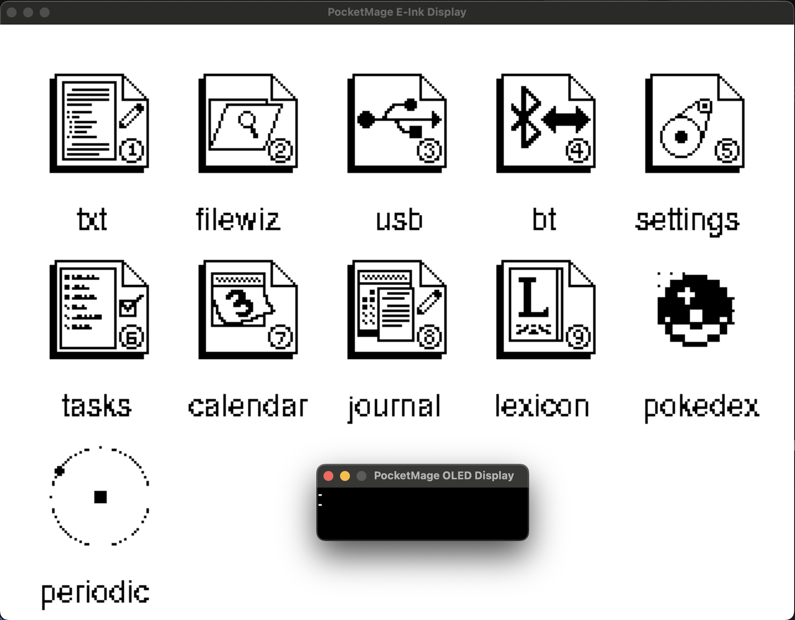
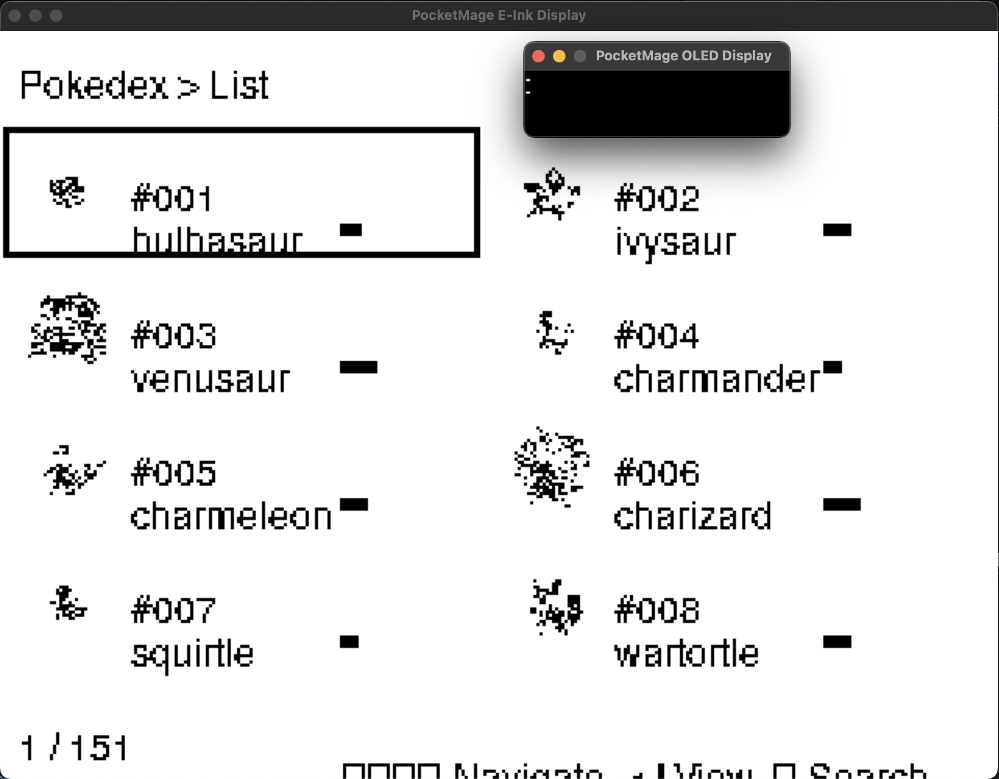
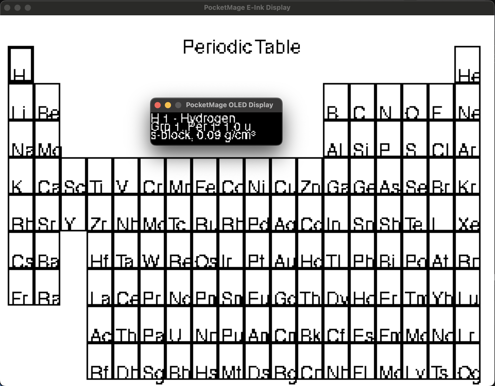

# PocketMage Desktop Emulator

A comprehensive SDL2-based desktop emulator for the PocketMage handheld E-ink PDA device, featuring multiple applications including text editing, file management, task tracking, journaling, and a fully functional Pokédex.


## Quick Start

### Prerequisites
- **SDL2** and **SDL2_ttf** development libraries
- **CMake** 3.16 or later
- **C++17** compatible compiler
- **curl** or **wget** (for automatic font downloading)

### Build Instructions

**Automated Build (Recommended):**
```bash
# macOS and Linux - handles dependencies and fonts automatically
./build.sh

# For clean build
./build.sh --clean

# Check dependencies without building
./build.sh --dry-run
```

**Manual Build:**

**macOS (Homebrew):**
```bash
brew install sdl2 sdl2_ttf cmake
./fonts/download_fonts.sh  # Download fonts automatically
mkdir build && cd build
cmake .. -DCMAKE_BUILD_TYPE=Release
make -j$(sysctl -n hw.ncpu)
```

**Linux (Ubuntu/Debian):**
```bash
sudo apt-get install libsdl2-dev libsdl2-ttf-dev cmake curl g++
./fonts/download_fonts.sh  # Download fonts automatically
mkdir build && cd build
cmake .. -DCMAKE_BUILD_TYPE=Release
make -j$(nproc)
```

**Windows:**
If vcpkg isn't installed, first install git from https://git-scm.com/downloads/win

Check your git version:
```bash
git --version
```

Install vcpkg and SDL2:
```bash
git clone https://github.com/Microsoft/vcpkg.git C:\vcpkg
C:\vcpkg\bootstrap-vcpkg.bat
vcpkg install sdl2 sdl2-ttf:x64-windows
```

### Build & Run

```bash
cd desktop_emulator
cmake -S . -B build -DCMAKE_BUILD_TYPE=Release
cmake --build build --config Release
./build/Release/PocketMage_Desktop_Emulator
```

### E-ink Simulation Mode

Experience realistic E-ink display behavior with the built-in simulation mode:

```bash
# Enable E-ink simulation on startup
export POCKETMAGE_EINK_SIM=1
./build/PocketMage_Desktop_Emulator
```

**E-ink Simulation Features:** (Work in Progress)
- **Realistic Refresh Patterns**: Simulates actual E-ink display refresh behavior
- **Ghosting Effects**: Configurable ghosting simulation (0.02f-0.12f intensity)
- **Refresh Timing**: Full refresh (~450ms) and partial refresh (~150ms) simulation
- **Visual Effects**: Optional white→black flash during full refreshes

**Runtime Hotkeys:**
- **F5**: Toggle E-ink simulation ON/OFF
- **F6**: Force full refresh on next frame
- **F7**: Cycle partial ghosting level (0 → 0.04 → 0.08 → 0.12 → 0)
- **F8**: Toggle wipe stripe width (18px ↔ 10px)


*The Pokédex showing the complete list of Generation 1 Pokémon with sprites and navigation*

### **Periodic Table**
Interactive periodic table of elements with detailed information:


*Complete periodic table with element selection and detailed information display*

#### **Pokédex Navigation:**
- `↑/↓` - Navigate through Pokémon list
- `Enter` - View detailed Pokémon information
- `Backspace` - Enter search mode
- `←/→` - Browse between Pokémon in detail view
- `ESC` - Return to home screen

## Image to Icon Converter

PocketMage includes a powerful `image_to_icon` utility for creating custom 40x40 pixel icons from any image:

### Features
- **AUTO-CROPS**: Automatically detects content bounds and removes white space
- **FILLS SQUARE**: Scales content to use entire 40x40 pixel area for maximum visibility
- **COLOR INVERSION**: `--invert` flag for negative/positive conversion
- **SMART SCALING**: Content-aware resizing eliminates empty borders

### Building the Converter

```bash
cd desktop_emulator/utils/Image
make image_to_icon
```

### Usage

```bash
./image_to_icon <input_image> <output_file> <array_name> [threshold] [--invert]
```

**Examples:**
```bash
# Auto-crop pokeball to 40x40 icon
./image_to_icon pokeball.png pokeball_icon.h pokeballIcon

# Auto-crop with custom threshold
./image_to_icon atom.jpg atom_icon.h atomIcon 100

# Auto-crop with color inversion (great for atoms/molecules)
./image_to_icon hydrogen.png hydrogen_icon.h hydrogenIcon 128 --invert

# Any image becomes a perfect 40x40 PocketMage icon!
./image_to_icon any_image.png my_icon.h myAppIcon
```

### Integration with PocketMage

1. **Generate your icon**: `./image_to_icon my_image.png my_icon.h myAppIcon`
2. **Copy the array**: Copy the generated array from `my_icon.h` to `Code/PocketMage_V3/src/assets.cpp`
3. **Update the home screen**: Replace an existing icon in the `homeIconsAllArray` with your new icon name

### Tips for Best Results
- Any image size works - it will auto-crop
- Use high contrast images for better e-ink display
- Try `--invert` flag for better contrast (especially atoms, molecules, dark subjects)
- Adjust threshold (80-180) if needed, but defaults usually work great
- Simple designs work best on small 40x40 displays

## Technical Architecture

### **Dual-Display System**
PocketMage features a unique dual-display setup:
- **E-ink Display**: Primary 320x240 display for main applications
- **OLED Display**: Small secondary display for status information and quick navigation

### **Emulation Features**
- **Hardware Simulation**: Complete emulation of E-ink refresh patterns
- **File System**: Virtual SD card with persistent storage
- **Keyboard Input**: Full keyboard support with special function keys
- **Real-time Clock**: Date/time functionality for journals and tasks

### **Input System**
- Standard keyboard input with special key mappings
- Function key layer for advanced operations
- Context-sensitive controls per application

## Getting Started

### Prerequisites
- C++ compiler with C++17 support
- SDL2 development libraries
- Make or CMake build system

## Controls & Navigation

### Keyboard Controls

| Desktop Key | PocketMage Function | ASCII Code |
|-------------|-------------------|------------|
| ↑ Arrow Key | Navigate Up | 19 |
| ↓ Arrow Key | Navigate Down | 21 |
| ← Arrow Key | Navigate Left | 20 |
| → Arrow Key | Navigate Right | 18 |
| Enter | Select/Confirm | 13 |
| Backspace | Delete/Back | 8 |
| Escape | Return to home/exit application | 27 |
| Home | Return to home screen | 12 |
| Letters | Text input | a-z, A-Z |
| Numbers | Numeric input | 0-9 |
| Space | Space character | 32 |
| Close Window | Quit emulator | - |

### E-ink Simulation Hotkeys (Work in Progress)

| Key | Function |
|-----|----------|
| **F5** | Toggle E-ink simulation ON/OFF |
| **F6** | Force full refresh on next frame |
| **F7** | Cycle partial ghosting level (0→0.04→0.08→0.12→0) |
| **F8** | Toggle wipe stripe width (18px↔10px) |

### Home Screen Commands
Type commands and press Enter:
- `pokedex` or `10` - Launch Pokédex
- `journal` or `8` - Open Journal
- `tasks` or `6` - Task Manager
- `text` or `1` - Text Editor
- `file` or `2` - File Wizard
- `settings` or `5` - System Settings

## Display Windows

- **E-Ink Window**: 310x240 pixels, scaled 3x for visibility (930x720 on screen)
- **OLED Window**: 256x32 pixels, scaled 3x for visibility (768x96 on screen)

Both windows update in real-time as applications draw to the displays.

## Project Structure

```
desktop_emulator/
├── CMakeLists.txt          # Build configuration
├── include/
│   ├── desktop_display_sdl2.h # SDL2 display interface
│   ├── desktop_display.h   # Base display interface
│   └── pocketmage_compat.h # Hardware abstraction layer
├── src/
│   ├── main_new.cpp        # Main emulator entry point
│   ├── desktop_display_sdl2.cpp # SDL2 implementation
│   └── hardware_shim.cpp   # Mock hardware functions
├── fonts/                  # Bundled fonts (cross-platform)
│   ├── DejaVuSans.ttf     # Primary UI font
│   ├── DejaVuSansMono.ttf # Monospace font
│   ├── download_fonts.sh  # Automatic font downloader script
│   └── README.md          # Font licensing information
├── data/                   # Data files directory
│   ├── pokemon/           # Pokémon database files
│   ├── journal/           # Journal entries
│   └── sys/               # System files
└── build/                 # Build output directory
```

## Data Sources

### Pokémon Data
The Pokédex uses data scraped from the official PokéAPI, including:
- Official Pokémon statistics and information
- Accurate Pokédex descriptions
- Complete type and species data

For more information about the Pokémon data collection, see [README_pokemon_scraper.md](README_pokemon_scraper.md).

## Development Workflow

1. **Code Changes**: Modify your PocketMage application code
2. **Build**: Run `cmake --build build` to rebuild
3. **Test**: Launch the emulator to see changes immediately
4. **Debug**: Use desktop debugging tools and console output
5. **Deploy**: Flash to hardware only for final validation

## Hardware Abstraction

The emulator provides complete implementations for:
- **Displays**: GxEPD2 (E-Ink) and U8G2 (OLED) with SDL2 rendering
- **Input**: TCA8418 keyboard matrix with desktop keyboard mapping
- **Storage**: SD card filesystem using local data directory
- **Sensors**: Battery, touch slider, RTC with realistic behavior
- **Communication**: Serial, preferences with file-based storage

## Troubleshooting

**Font Issues**: The emulator includes bundled DejaVu fonts for cross-platform compatibility. If text doesn't appear:
- Ensure the `fonts/` directory exists with `DejaVuSans.ttf` and `DejaVuSansMono.ttf`
- Run `./fonts/download_fonts.sh` to download missing fonts automatically
- The emulator automatically falls back to system fonts if bundled fonts aren't found

**Build Errors**: Ensure SDL2 and SDL2_ttf development libraries are installed.

**Performance**: The emulator runs at ~30 FPS. Adjust the delay in `main_new.cpp` if needed.

## Data Directory

Place your PocketMage data files in the `data/` directory:
- `pokemon/` - Pokémon database files (pokemon_data.rec, string tables)
- `sys/` - System files
- `journal/` - Journal entries  
- `dict/` - Dictionary files
- Text files, tasks, etc.

The emulator will create this structure automatically when needed.

## Extending the Emulator

To add support for more PocketMage features:

1. Add implementations in `pocketmage_compat.h` and hardware abstraction files
2. Update the display interface in `desktop_display_sdl2.h/cpp`  
3. Modify `main_new.cpp` to include your app's logic

## Acknowledgments

- **PokéAPI**: For providing comprehensive Pokémon data
- **Periodic Table JSON**: For comprehensive periodic table data - https://github.com/Bowserinator/Periodic-Table-JSON
