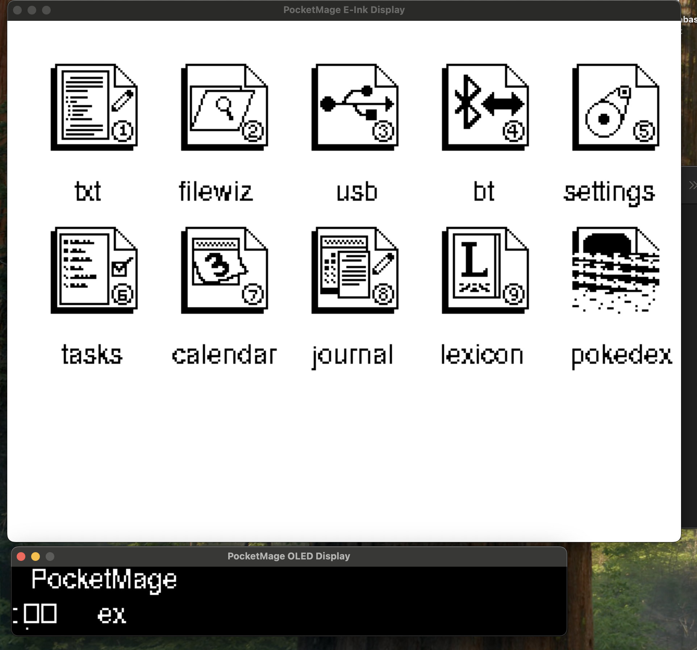
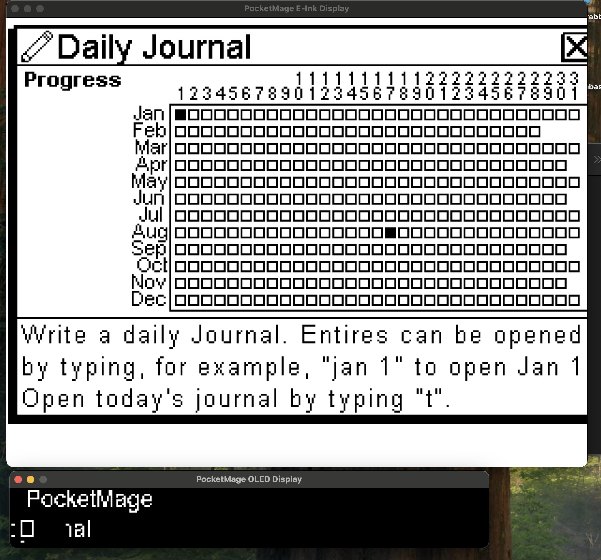
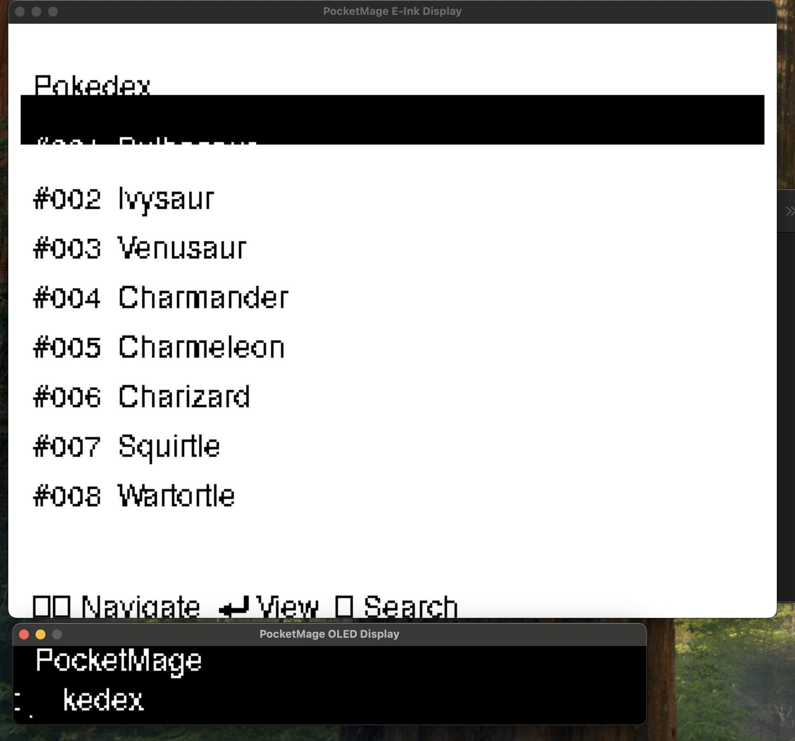
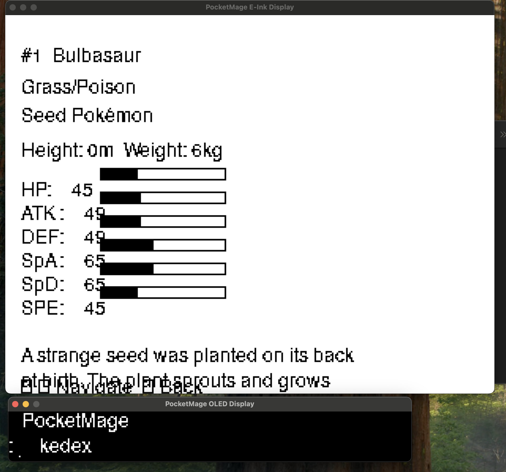

# PocketMage Desktop Emulator

A comprehensive SDL2-based desktop emulator for the PocketMage handheld E-ink PDA device, featuring multiple applications including text editing, file management, task tracking, journaling, and a fully functional Pokédex.



## Overview

PocketMage is a retro-inspired handheld computing device with an E-ink display that provides a unique writing and productivity experience. This emulator brings the complete PocketMage experience to your desktop, allowing you to explore all features of this fascinating handheld device without requiring physical hardware.

## Quick Start

### Prerequisites

**macOS:**
```bash
brew install sdl2 sdl2_ttf cmake
```

**Ubuntu/Debian:**
```bash
sudo apt-get install libsdl2-dev libsdl2-ttf-dev cmake g++
```

**Windows:**
```bash
vcpkg install sdl2 sdl2-ttf
```

### Build & Run

```bash
cd desktop_emulator
cmake -S . -B build -DCMAKE_BUILD_TYPE=Release
cmake --build build -j
./build/PocketMage_Desktop_Emulator
```

## Key Features

### 🏠 **Home Screen & Navigation**
- Clean, icon-based interface optimized for E-ink displays
- Command-line style navigation
- Quick access to all applications via keyboard shortcuts

### 📝 **Text Editor**
- Full-featured text editor with multiple font options
- Dynamic text wrapping and scrolling
- File management integration
- Auto-save functionality

### 📁 **File Wizard**
- Browse and manage files on the virtual SD card
- Create, rename, copy, and delete files
- Integrated with text editor for seamless file operations

### 📋 **Task Manager**
- Create and manage tasks with due dates
- Priority system for task organization
- Visual task tracking on the home screen

### 📅 **Calendar**
- Full calendar view with event support
- Date-based navigation
- Integration with task management

### 📖 **Journal**
- Daily journaling with automatic date-based file creation
- Year-view calendar showing journaled days
- Quick access to today's journal entry



### 🔍 **Pokédex Application**
The crown jewel of PocketMage is its fully functional Pokédex featuring:

#### **Pokédex Features:**
- **Complete Pokémon Database**: All Generation 1 Pokémon with detailed information
- **Advanced Search**: Search Pokémon by name with real-time filtering
- **Detailed Pokémon Profiles**: Including stats, types, descriptions, and physical data
- **Visual Stat Bars**: Graphical representation of Pokémon statistics
- **Navigation**: Browse through Pokémon with arrow keys


*The Pokédex list view showing numbered Pokémon entries*


*Detailed Pokémon information with stats, types, and description*

#### **Pokédex Data:**
Each Pokémon entry includes:
- **Basic Information**: National Dex number, name, type(s)
- **Physical Stats**: Height, weight, and species classification
- **Battle Stats**: HP, Attack, Defense, Special Attack, Special Defense, Speed
- **Pokédex Entry**: Official flavor text descriptions
- **Visual Elements**: Stat bars and organized layout

#### **Pokédex Navigation:**
- `↑/↓` - Navigate through Pokémon list
- `Enter` - View detailed Pokémon information
- `Backspace` - Enter search mode
- `←/→` - Browse between Pokémon in detail view
- `ESC` - Return to home screen

### ⚙️ **Settings**
- Customizable display and behavior options
- Power management settings
- System configuration

## Technical Architecture

### **Dual-Display System**
PocketMage features a unique dual-display setup:
- **E-ink Display**: Primary 320x240 display for main applications
- **OLED Display**: Small secondary display for status information and quick navigation

### **Emulation Features**
- **Hardware Simulation**: Complete emulation of E-ink refresh patterns
- **File System**: Virtual SD card with persistent storage
- **Keyboard Input**: Full keyboard support with special function keys
- **Real-time Clock**: Date/time functionality for journals and tasks

### **Input System**
- Standard keyboard input with special key mappings
- Function key layer for advanced operations
- Context-sensitive controls per application

## Getting Started

### Prerequisites
- C++ compiler with C++17 support
- SDL2 development libraries
- Make or CMake build system

## Controls

| Desktop Key | PocketMage Function |
|-------------|-------------------|
| Arrow Keys  | Navigation (Up/Down/Left/Right) |
| Enter       | Select/Confirm |
| Backspace   | Delete/Back |
| Escape      | Return to home/exit application |
| Letters     | Text input |
| Numbers     | Numeric input |
| Space       | Space character |
| Close Window| Quit emulator |

### Home Screen Commands
Type commands and press Enter:
- `pokedex` or `10` - Launch Pokédex
- `journal` or `8` - Open Journal
- `tasks` or `6` - Task Manager
- `text` or `1` - Text Editor
- `file` or `2` - File Wizard
- `settings` or `5` - System Settings

## Display Windows

- **E-Ink Window**: 310x240 pixels, scaled 3x for visibility (930x720 on screen)
- **OLED Window**: 256x32 pixels, scaled 3x for visibility (768x96 on screen)

Both windows update in real-time as applications draw to the displays.

## Project Structure

```
desktop_emulator/
├── CMakeLists.txt          # Build configuration
├── include/
│   ├── desktop_display_sdl2.h # SDL2 display interface
│   ├── desktop_display.h   # Base display interface
│   └── pocketmage_compat.h # Hardware abstraction layer
├── src/
│   ├── main_new.cpp        # Main emulator entry point
│   ├── desktop_display_sdl2.cpp # SDL2 implementation
│   └── hardware_shim.cpp   # Mock hardware functions
├── data/                   # Data files directory
│   ├── pokemon/           # Pokémon database files
│   ├── journal/           # Journal entries
│   └── sys/               # System files
└── build/                 # Build output directory
```

## Applications Deep Dive

### Pokédex Implementation
The Pokédex is implemented as a complete application with three main states:
1. **List View**: Scrollable list of all Pokémon
2. **Detail View**: Comprehensive Pokémon information
3. **Search Mode**: Real-time name-based searching

The data is loaded from optimized binary files for quick access, with fallback to sample data for demonstration purposes.

### E-ink Optimization
All applications are designed for E-ink displays with:
- **Minimal Refreshes**: Updates only changed screen regions
- **High Contrast**: Black and white graphics optimized for E-ink
- **Readable Fonts**: Multiple font options for different viewing preferences
- **Efficient Layouts**: Information density optimized for small screens

## Data Sources

### Pokémon Data
The Pokédex uses data scraped from the official PokéAPI, including:
- Official Pokémon statistics and information
- High-quality sprite images
- Accurate Pokédex descriptions
- Complete type and species data

For more information about the Pokémon data collection, see [README_pokemon_scraper.md](README_pokemon_scraper.md).

## Contributing

This project welcomes contributions! Areas of interest include:
- Additional Pokémon generations
- New applications and features
- UI/UX improvements
- Performance optimizations
- Hardware compatibility

## Development Workflow

1. **Code Changes**: Modify your PocketMage application code
2. **Build**: Run `cmake --build build` to rebuild
3. **Test**: Launch the emulator to see changes immediately
4. **Debug**: Use desktop debugging tools and console output
5. **Deploy**: Flash to hardware only for final validation

## Hardware Abstraction

The emulator provides complete implementations for:
- **Displays**: GxEPD2 (E-Ink) and U8G2 (OLED) with SDL2 rendering
- **Input**: TCA8418 keyboard matrix with desktop keyboard mapping
- **Storage**: SD card filesystem using local data directory
- **Sensors**: Battery, touch slider, RTC with realistic behavior
- **Communication**: Serial, preferences with file-based storage

## Technical Implementation

### Display System
- **Dual Windows**: Separate SDL2 windows for E-Ink and OLED displays
- **Software Rendering**: Uses SDL_RENDERER_SOFTWARE to prevent Metal GPU crashes on macOS
- **UTF-8 Support**: Proper character encoding for international text
- **Real-time Updates**: Immediate visual feedback for all drawing operations

### Input Handling
- **Arrow Key Navigation**: Proper ASCII mapping (19=UP, 21=DOWN, 20=LEFT, 18=RIGHT)
- **Visual Selection**: Inverted color highlighting for selected items
- **Text Input**: Full keyboard support with special character handling

## Troubleshooting

**Font Issues**: The emulator tries to load system fonts. If text doesn't appear:
- macOS: Ensure Monaco font is available
- Linux: Install DejaVu fonts (`sudo apt-get install fonts-dejavu`)
- Windows: Update font paths in `desktop_display_sdl2.cpp`

**Build Errors**: Ensure SDL2 and SDL2_ttf development libraries are installed.

**Performance**: The emulator runs at ~30 FPS. Adjust the delay in `main_new.cpp` if needed.

**Metal GPU Crashes**: The emulator uses software-only rendering to prevent macOS Metal GPU assertion failures.

## Data Directory

Place your PocketMage data files in the `data/` directory:
- `pokemon/` - Pokémon database files (pokemon_data.rec, string tables)
- `sys/` - System files
- `journal/` - Journal entries  
- `dict/` - Dictionary files
- Text files, tasks, etc.

The emulator will create this structure automatically when needed.

## Extending the Emulator

To add support for more PocketMage features:

1. Add implementations in `pocketmage_compat.h` and hardware abstraction files
2. Update the display interface in `desktop_display_sdl2.h/cpp`  
3. Modify `main_new.cpp` to include your app's logic
4. Rebuild and test

## Contributing

This project welcomes contributions! Areas of interest include:
- Additional Pokémon generations
- New applications and features
- UI/UX improvements
- Performance optimizations
- Hardware compatibility

## Acknowledgments

- **PokéAPI**: For providing comprehensive Pokémon data
- **E-ink Community**: For display technology insights
- **Retro Computing Enthusiasts**: For inspiration and feedback

---

*PocketMage represents the perfect fusion of retro computing aesthetics with modern functionality, bringing the joy of handheld computing to a new generation while honoring the classics that came before.*
